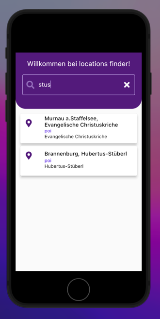

Hello Team,

Please find the github link to the project and the android apk in the zip file.
As the problem statement is in German and I am still not proficient with German, my understanding of the problem is based on the translation.

I have chosen Flutter framework to develop the application.

**Problem statement based on the translation and my understanding:**
Single page application with a text field needs to be created.
Users can enter the starting location in the text field and the application has to display the possible hits.
The name and type of the hit are the mandatory fields to be displayed.

**My approach to the problem and implementation details:**
1. As an initial step, I created different folders for different layers of the app i.e cubits, data, and screens. The other 2 folders, shared_widgets, and utils are for reusable/shared widgets and utility files respectively.
2. In-order to communicate with the API and parse the response from API, created a model(Location model) which contains details of the location like id, name, type, etc.
3. To communicate with the API, I am using HTTP library. And as a wrapper to the API, I have created a repository that calls the api and converts the raw JSON response from the to the model.
5. I am using Bloc library for logic implementation and state management as it keeps the business logic and UI separate. Also, as Mentz team is using the same library for its apps, I thought it would be appropriate to use the same state management library.
6. I chose cubit because it is lightweight and there is only one event to handle i.e to fetch the locations from API and emit different states based on different responses.
7. In screens, I am using RepositoryProvider and BlocProvider.
8. To handle the state changes, I am using BlocConsumer widget. Listener to show the Snackbar for No Connectivity and builder to update the UI on state changes.
9. TextEditingController handles the input from the user. As and when the user starts entering the input and if the input characters are > 2, for every character, an API call is made and the response is fetched. Locations/Hits are shown to the user using Listview.builder widget as it creates the items as and when the user scrolls onto the screen. This improves the performance of the App.
10. To show each hit, I am using ListTile widget. Based on the type of location, the icon of the listtile changes.

